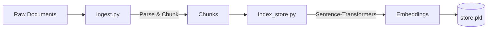
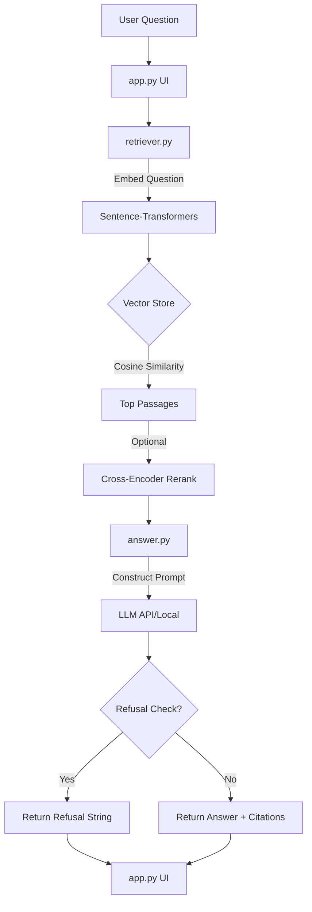

# System Architecture

## 1. High-Level Architecture
VeriDoc follows a standard Retrieval-Augmented Generation (RAG) architectural pattern. It consists of an offline ingestion pipeline for document processing and an online retrieval and answering pipeline for user interactions. The entire system runs as a monolithic Python application orchestrated by Streamlit.

## 2. Architecture Pattern
- **Pattern:** Retrieval-Augmented Generation (RAG)
- **Deployment Style:** Monolithic application (Streamlit)
- **State Management:** In-memory vector store (NumPy + Pickle) and Streamlit session state.

## 3. Major Modules and Responsibilities
- `app.py`: The entry point. Handles the Streamlit UI, state management (chat history), user inputs (text and voice), and displays the results.
- `ingest.py`: Handles reading raw documents (`.pdf`, `.docx`, `.txt`, `.html`), performing OCR if necessary, cleaning text, and chunking it into smaller segments.
- `index_store.py`: Manages the embedding of text chunks (using `sentence-transformers`) and serialization/deserialization of the NumPy vector database.
- `retriever.py`: Executes semantic search. It compares the user query embedding against the stored document embeddings, applies optional cross-encoder re-ranking, and returns the top-K relevant passages.
- `answer.py`: Constructs the strict grounding prompt using retrieved passages and calls the selected LLM (Ollama, Gemini, or OpenAI). It also handles the "honest refusal" detection logic.
- `config.py`: Centralized configuration management using environment variables.

## 4. Flows

### Ingestion Flow (Offline/Admin)

### Retrieval & Answering Flow (Online/User)

## 5. Important Dependencies and Relationships
- **Frontend -> Backend:** The Streamlit frontend (`app.py`) directly imports and calls functions from the backend modules (`retriever.retrieve`, `answer.ask`, `index_store.build_index`). There is no network separation (no HTTP API) between the frontend and backend.
- **LLM Abstraction:** `answer.py` abstracts the specific LLM integration, conditionally routing to `_call_ollama`, `_call_openai`, or `_call_gemini` based on `config.LLM_MODE`.
